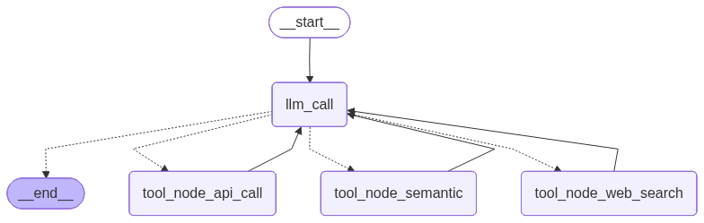

# Jarvis the Research Assistant

In this project we make Jarvis a chatbot research assistant that can perform several services:

### Service 1 
API calls to ArXiv (can expand it later if I have time as semantic scholar is free). This is the first service.
The response from the arxiv is in xlm so I parse the xlm response and move it into the dictionary and then use the LLM to summarise the results and do a mini literature review using the papers found through the API call.

### Service 2 
Perform semantic searches based on user query n its local database. 
TO construct the local database, I downloaded a large csv file from [Kaggle](https://www.kaggle.com/datasets/sumitm004/arxiv-scientific-research-papers-dataset?resource=download)
The file is larger than 40 MB so I trimmed it down (kept the first 15,000 rows).
I added my chromadb folder that stores the embeddings to the git ignore because the file size was too large to upload. The notebook to make the embeddings is in the repo. 

*To construct the embedding I did the following in a notebook:*
- Listed the required columns, and checks if the required columns are missing (title, author publication date etc.)
- Then loaded them in a pandas dataframe as backend,
- I then initialised a chromadb client in the same directory, I used the Persistent Client 
- I made a list of the document ids and summaries and then I kept the metadata as ["title", "authors", "published_date", "category"] and put them in a dictionary
- I then fed the rows of my csv file in batches of 100 to be vectorised into the chromadb client I had made and I used OpenAIEmbeddings to create the embeddings using text-embedding-3-small

**Note:** I tired doing the embeddings in a .py file but the same path that worked in the same directory for the ipynb file failed to work for the .py file (probably ipython kernel is in a different directory that the execution for the .py file)

Having the above the tool can do a semantic search of the user query and the chromadb to find the best match and present those results. The results are limited as we only have 15000 rows. 

### Service 3
OpenAI Web search and summarisation. I tried MCP servers from glama but I could not work or deploy them, so decided on the web search with summarisation. 

### Operational Graph
Here is the operation graph for this assistant that I have made, each tool node goes back to the llm call.

Files are tested and they work. 
As required the assistant does not respond to questions about Taylor Swift. 